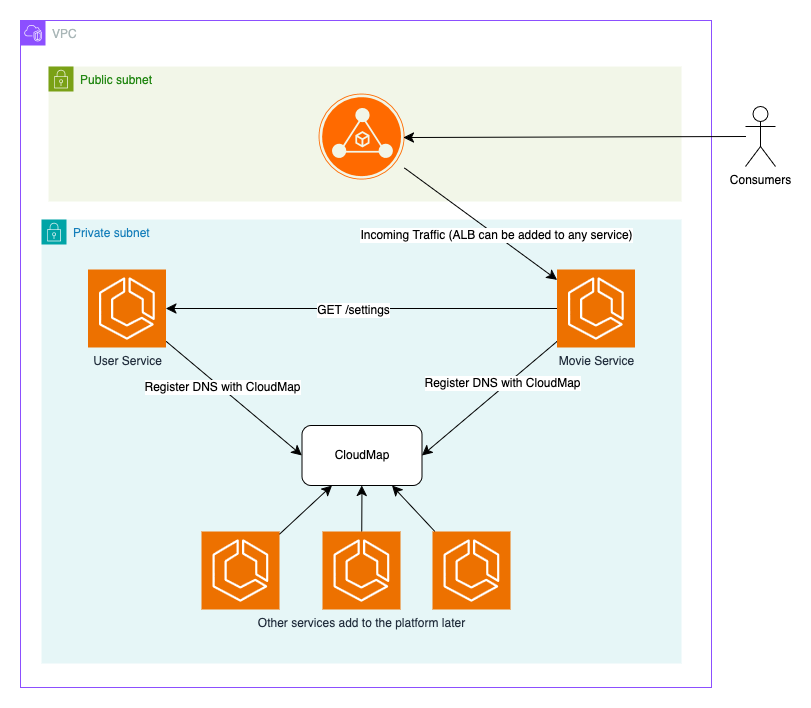

# Unified Microservices Orchestration Platform

[tldr; How do I use this thing?](#usage)

:warning: **_Disclaimer_** :warning:
This CDK Application is a blueprint or starting point for developing your own microservices platform. It has not been deployed to avoid incurring infrastructure costs.

To make this functional, additional steps are required, such as:

-   Developing your own services.
-   Adding SSL/TLS certificates to the load balancer.
-   Configuring security, monitoring, and other production-grade requirements.
-   (...and more)

This blueprint is not production-ready and should not be treated as such. Use it as a reference or foundation for building and customizing your platform according to your specific needs.

## TOC

1. [Summary](#summary)
2. [Project Structure](#project-structure)
3. [Architecture](#architecture)
4. [Usage](#usage)
    1. [Assume credentials & Bootstrap account](#assume-credentials--bootstrap-account)
    2. [Ensure configuration is correct](#ensure-configuration-is-correct)
    3. [Deploy CDK infrastructure](#deploy-cdk-infrastructure)
5. [Local Development](#local-development)

## Summary

This CDK application is designed to provision and manage a fully managed microservices architecture leveraging Amazon ECS Fargate. The infrastructure is dynamically configured via a configuration file that specifies services and their associated settings, such as CPU, memory, and whether a load balancer should be attached. Each service can be assigned a task role to grant access to necessary AWS resources. Additionally, dependencies between services can be defined, enabling the automatic injection of dependent services' DNS names as environment variables (e.g., USER_SERVICE_DNS) to facilitate seamless communication.

For simplicity, the services are defined within this repository. In a real-world scenario, however, these services would typically be managed in separate repositories, owned and maintained by independent teams.

Looking ahead, I plan to extend the service constructs to support additional service types, such as EC2 Auto Scaling Groups and Lambda functions, to further enhance the flexibility and scalability of the architecture.

## Project structure

```
micro-service-platform/          # Root directory of the project
├── bin                          # CDK application entry point
├── config                       # CDK configuration file for multi-environment infrastructure
├── constructs                   # Construct Library (This is where we do most of the heavy lifting)
├── lib                          # CDK Stack Initialization
├── services                     # Application Services
├── test                         # Infrastructure Unit tests
└── utils                        # Utility functions
```

## Architecture

Below is an example architecture diagram of what can be built using this infrastructure. The design is highly flexible—the Application Load Balancer (ALB) can be deployed in the public subnet if needed, but this is optional and configurable.

A core principle of this application is its configuration-driven approach. All configurations are defined in ./config/config.ts, where you specify settings for each environment, including service locations, container CPU and memory allocation, and load balancer configurations.

Additional services can be easily integrated in the future by creating and building them in the services directory and adding their details to the configuration file.



## Usage

### Development tools

```bash
node --version
# v18.18.2

npm install -g aws-cdk
cdk --version
# 2.179 (Use any 2.x version greater than this)

docker --version
# Docker version 20.10.10, build b485636

# For development - we use pre-commit hooks
brew install pre-commit
pre-commit install
```

### Assume credentials & Bootstrap account

1. [Assume AWS Credentials](https://docs.aws.amazon.com/cli/v1/userguide/cli-chap-configure.html)
    ```bash
    # Once credentials have been assumed run this command
    export CDK_DEFAULT_ACCOUNT=$(aws sts get-caller-identity --query "Account" --output text)
    ```
1. Bootstrap CDK account

    ```bash
    export AWS_DEFAULT_REGION="eu-west-1"
    export CDK_DEFAULT_REGION=$AWS_DEFAULT_REGION

    cdk bootstrap
    ```

### Ensure configuration is correct

1. Check the environment configuration and ensure it matches your services.

```typescript
// ./config/config.ts

const CONFIGURATION: IConfig = {
    dev: {
        account: '12345678901',
        region: 'eu-west-1',
        services: [
            {
                serviceDockerfileDirectory: path.join(__dirname, '../services/user-service'),
                name: 'user-service',
                containerPort: 80,
                taskRolePolicies: [],
            },
            {
                serviceDockerfileDirectory: path.join(__dirname, '../services/movie-service'),
                name: 'movie-service',
                dependentServices: [
                    {
                        name: 'user-service',
                        port: 80,
                    },
                ],
                taskRolePolicies: [],
            },
        ],
    },
};
```

### Deploy CDK infrastructure

Once your configuration has been successfully set, you can simply run the following command

:warning: `dev` is the key in the configuration file.

```bash
cdk deploy -c "environment=dev"
```

## Service Development

```bash
cd services

# Use docker-compose for local development
docker-compose up --build

curl "http://localhost:8081/movies?user_id=1"
```
